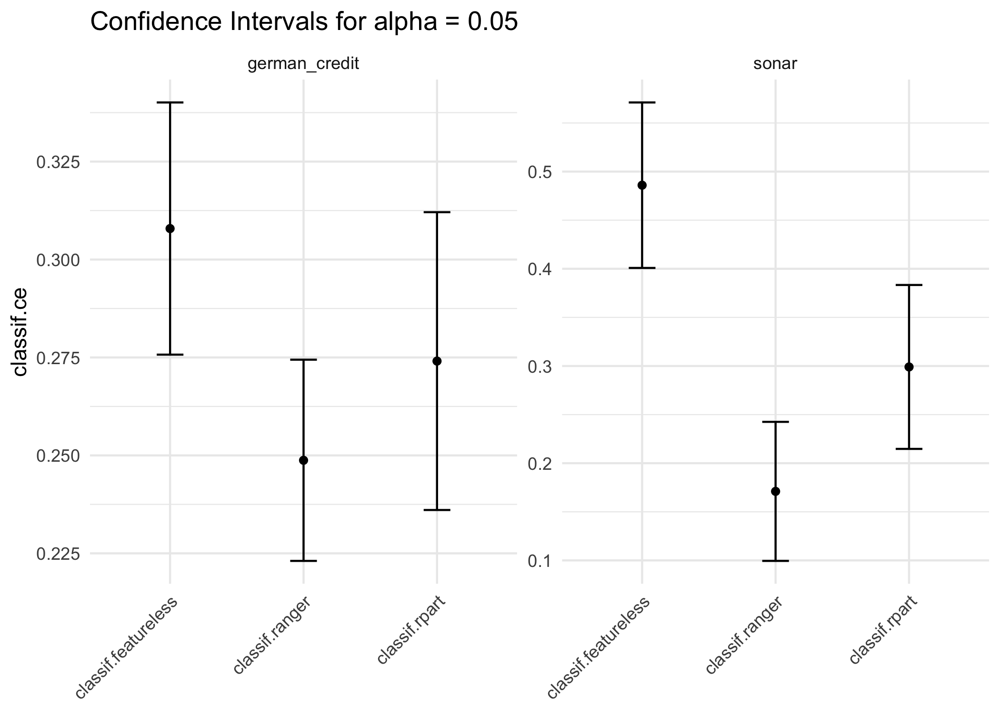

<!-- README.md is generated from README.Rmd. Please edit that file -->

# mlr3inferr <a href="https://mlr3inferr.mlr-org.com"></a>

Methods for statistical **inf**erence on the generalization **err**or.

Package website: [release](https://mlr3inferr.mlr-org.com/) \|
[dev](https://mlr3inferr.mlr-org.com/dev/)

<!-- badges: start -->

[](https://github.com/mlr-org/mlr3inferr/actions/workflows/r-cmd-check.yml)
[](https://CRAN.R-project.org/package=mlr3inferr)
[](https://stackoverflow.com/questions/tagged/mlr3)
[](https://lmmisld-lmu-stats-slds.srv.mwn.de/mlr_invite/)
<!-- badges: end -->

## Installation

``` r
# Install release from CRAN
install.packages("mlr3inferr")
# Install development version from GitHub
pak::pkg_install("mlr-org/mlr3inferr")
```

## What is `mlr3inferr`?

The main purpose of the package is to allow to obtain confidence
intervals for the generalization error for a number of resampling
methods. Below, we evaluate a decision tree on the sonar task using a
holdout resampling and obtain a confidence interval for the
generalization error. This is achieved using the `msr("ci.holdout")`
measure, to which we pass another `mlr3::Measure` that determines the
loss function.

``` r
library(mlr3inferr)

rr = resample(tsk("sonar"), lrn("classif.rpart"), rsmp("holdout"))
# 0.05 is also the default
ci = msr("ci.holdout", "classif.acc", alpha = 0.05)
rr$aggregate(ci)
#>       classif.acc classif.acc.lower classif.acc.upper 
#>         0.7391304         0.6347628         0.8434981
```

It is also possible to select the default inference method for a certain
`Resampling` method using `msr("ci")`

``` r
ci_default = msr("ci", "classif.acc")
rr$aggregate(ci_default)
#>       classif.acc classif.acc.lower classif.acc.upper 
#>         0.7391304         0.6347628         0.8434981
```

With [`mlr3viz`](https://mlr3viz.mlr-org.com), it is also possible to
visualize multiple confidence intervals. Below, we compare a random
forest with a decision tree and a featureless learner:

``` r
library(mlr3learners)
library(mlr3viz)

bmr = benchmark(benchmark_grid(
  tsks(c("sonar", "german_credit")),
  lrns(c("classif.rpart", "classif.ranger", "classif.featureless")),
  rsmp("subsampling")
))

autoplot(bmr, "ci", msr("ci", "classif.ce"))
```



Note that:

- Some methods require pointwise loss functions, i.e. have an
  `$obs_loss` field.
- Not for every resampling method exists an inference method.
- There are combinations of datasets and learners, where inference
  methods can fail.

:warning: **Different point estimates for the same measure**

In general, the point estimate of `$aggregate(msr("ci", <key>))` will
**not** always exactly identical to the point estimate of
`$aggregate(msr(<key>))`. This is because the point estimation for the
former is defined by the inference method, and can for example, as is
the case for nested cross-validation, contain a bias correction term, or
use a different aggregation method. This is demonstrated in the example
below.

``` r
rr = resample(tsk("iris"), lrn("classif.rpart"), rsmp("nested_cv", folds = 5L, repeats = 20L))
ce = msr("classif.ce")
ci = msr("ci", ce)
c(rr$aggregate(ce)[[1]], rr$aggregate(ci)[[1]])
#> [1] 0.06466667 0.06646667
```

## Features

- Additional Resampling Methods
- Confidence Intervals for the Generalization Error for some resampling
  methods

## Inference Methods

| Key        | Label                   | Resamplings       | Only Pointwise Loss |
|:-----------|:------------------------|:------------------|:--------------------|
| ci.con_z   | Conservative-Z Interval | PairedSubsampling | false               |
| ci.cor_t   | Corrected-T Interval    | Subsampling       | false               |
| ci.holdout | Holdout Interval        | Holdout           | yes                 |
| ci.ncv     | Nested CV Interval      | NestedCV          | yes                 |
| ci.wald_cv | Wald CV Interval        | CV, LOO           | yes                 |

## Citing mlr3

If you use mlr3inferr, please cite our paper:

    @misc{kuempelfischer2024ciforge,
          title={Constructing Confidence Intervals for 'the' Generalization Error -- a Comprehensive Benchmark Study},
          author={Hannah Schulz-Kümpel and Sebastian Fischer and Thomas Nagler and Anne-Laure Boulesteix and Bernd Bischl and Roman Hornung},
          year={2024},
          eprint={2409.18836},
          archivePrefix={arXiv},
          primaryClass={stat.ML},
          url={https://arxiv.org/abs/2409.18836},
    }

## Acknowledgements

This R package is developed as part of the [Mathematical Research Data
Initiative](https://www.mardi4nfdi.de/about/mission).

## Bugs, Questions, Feedback

*mlr3inferr* is a free and open source software project that encourages
participation and feedback. If you have any issues, questions,
suggestions or feedback, please do not hesitate to open an “issue” about
it on the GitHub page!

In case of problems / bugs, it is often helpful if you provide a
“minimum working example” that showcases the behaviour (but don’t worry
about this if the bug is obvious).

Please understand that the resources of the project are limited:
response may sometimes be delayed by a few days, and some feature
suggestions may be rejected if they are deemed too tangential to the
vision behind the project.
